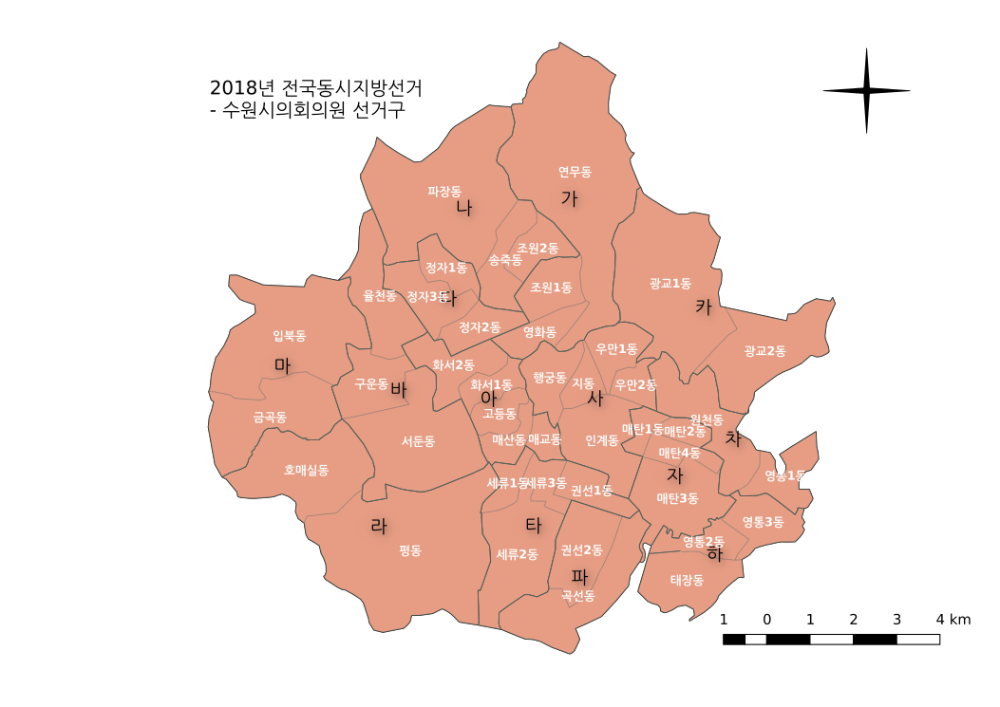

# 2018년 7차 전국동시지방선거 수원시의원 후보 선거비용 사용내역

[TOC]

## 개요

2018년 6월 13일날 치워진 7차 전국동시지방선거에서의 수원시의원 후보 선거비용 사용내역이다. 선거가 치뤄진 뒤 3개월동안 [중앙선거관리위원회 선거통계시스템](http://info.nec.go.kr/)을 통해 선거비용을 연람할 수 있다. 단 3개월만 가능하기에 수원시의원에 출마했던 후보들의 선거비용 사용 내역을 정리해 두었다.

> 선거구 수 :  15개(가~하)
>
> 후보 수 : 64명

## 수원시의원 선거구 (14)

#### 장안구

- 수원시 가 선거구(2) : 영화동, 연무동, 조원1동
- 수원시 나 선거구(2) : 조원2동, 송죽동, 파장동 
- 수원시 다 선거구(2) : 정자1동, 정자2동, 정자3동

#### 권선구

- 수원시 라 선거구(2) : 평동, 호매실동
- 수원시 마 선거구(2) : 금곡동, 입북동
- 수원시 바 선거구(3) : 율천동, 서둔동, 구운동
- 수원시 타 선거구(2) : 세류1동, 세류2동, 세류3동, 권선1동 
- 수원시 파 선거구(2) : 권선2동, 곡선동

#### 팔달구

- 수원시 사 선거구(3) : 인계동, 행궁동, 지동, 우만1동, 우만2동
- 수원시 아 선거구(2) : 매교동, 매산동, 고등동, 화서1동, 화서2동

#### 영통구

- 수원시 자 선거구(3) : 매탄1동, 매탄2동, 매탄3동, 매탄4동
- 수원시 차 선거구(2) : 원천동, 영통1동
- 수원시 카 선거구(2) : 광교1동, 광교2동
- 수원시 하 선거구(3) : 영통2동, 영통3동, 태장동

## 출처

- [중앙선거관리위원회 선거통계시스템](http://info.nec.go.kr/)

